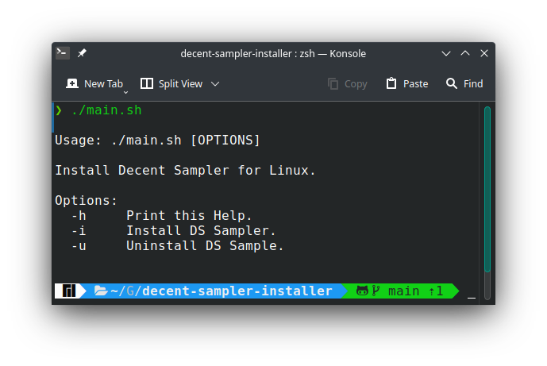

# decent-sampler-installer

An installer for [Decent Sampler](https://www.decentsamples.com/product/decent-sampler-plugin/) Software for Linux.



This is an installer for some cool audio sampler software that I use on my Linux Box. This installer extracts and install the stuff from the [official tar.gz package](https://www.decentsamples.com/product/decent-sampler-plugin/).

## Software

The original Decent Sampler package **must be** downloaded manually on the same directory before executing the install script.

- Decent_Sampler-1.5.12-Linux-x86_64 [version 1.5.12]

## Usage

- Download [Decent Sampler tar.gz](https://www.decentsamples.com/product/decent-sampler-plugin/)
- Clone repo and execute install script and follow the instructions.

```
git clone https://github.com/rolodoom/decent-sampler-installer.git
cd decent-sampler-installer
chmod +x main.sh && ./main.sh
```
